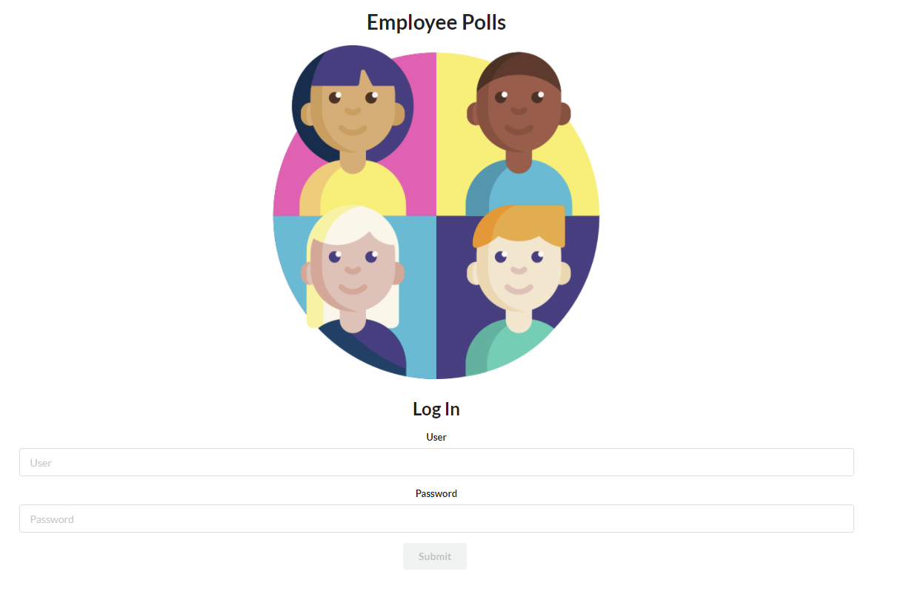
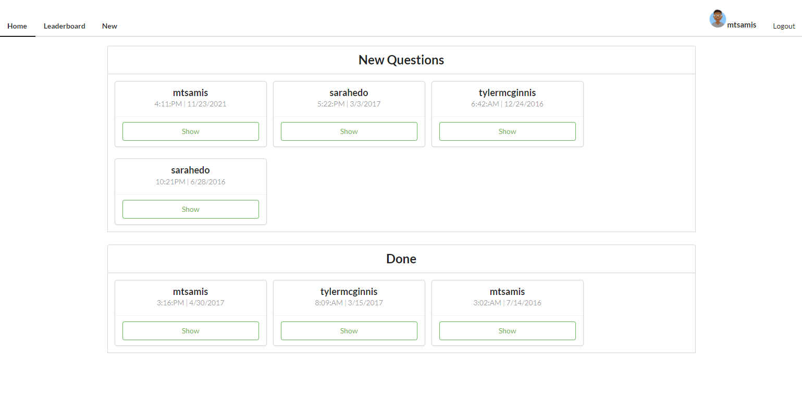
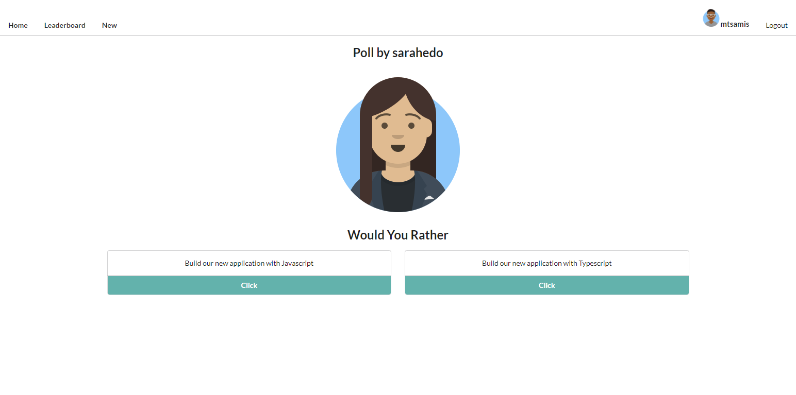
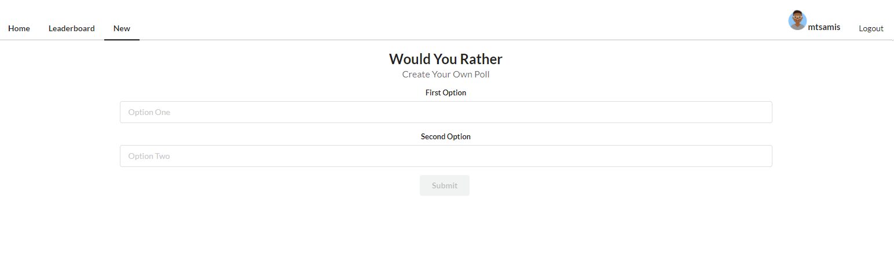
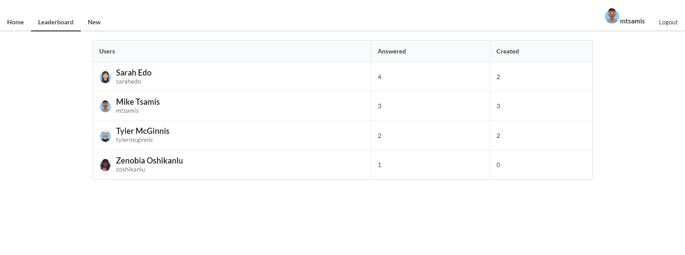

Employee Poll Project Instructions
Use React to build your application’s UI. Remember that composition is key. It’s rarely a mistake to break a component into smaller pieces. Look for opportunities to reuse your components.

We recommend using Vite to generate your submission since it's the easiest way to ensure you have everything the project reviewer will need to install and run your app.

By walking through the Planning Stage and the Coding Stage of the Chirper Project, we’ve given you a useful template for building Redux applications. We recommend using this template for building your “Employee Polls” Project. Remember that planning your project and its architecture before starting to code will save you a lot of debugging time later on!

Use Redux to manage your application state. For this application, most of the application’s state should be managed by Redux. You may use the component state to handle form input fields and controlled components. Otherwise, the rest of the state for your application should be controlled by your reducers.

In order to create unit tests for your project, you'll need to install jest and testing-library for the unit testing, snapshot testing, and DOM testing. You can add these to your project with npm.

npm command:

npm install --save-dev jest @testing-library/react @testing-library/jest-dom

While the focus (and specification) of this project is based on functionality rather than styling, please ensure that your app is presentable and easy to navigate.

Please carefully test your app against the rubric(opens in a new tab) to make sure all of the rubric requirements are met. Your project must meet all of the rubric criteria in order to pass.

Submission Instructions
Step 1
Before submitting, please verify that your project:

Meets specification according to the project rubric.
Includes all of the files necessary to install and launch your web application on a local web server. For files that include JSX, please refrain from using the .jsx extension (you can prefer .js). You can assume that your reviewer will have npm installed on their machine.
Adheres to our HTML(opens in a new tab), CSS(opens in a new tab), JavaScript(opens in a new tab), and Git(opens in a new tab) style guidelines.
Step 2
If you choose to develop your project in your Workspace, you can submit directly from your Workspace. When you're ready to submit, just click the "Submit Project" button.

If you choose to develop on your local machine, you will need to:

Push your project to GitHub, making sure to push the master branch.
On the project submission page choose the option "Submit with GitHub"
Select the repository for this project (you may need to connect your GitHub account first).
Sample Project
We encourage you to get creative with your projects by adding additional functionality and/or styling (after you've ensured that the project meets all of the specifications in the rubric)! Here are screenshots from an example:

This image shows an example of the login page for the project. It includes the name of the project (Employee Polls), an icon, the text "Log In", and the username and password fields. Below the username and password fields is a submit button.
Sample Login Page

This image shows an example of the Dashboard page for this project. It includes a Navigation bar at the top where the user has Home, Leaderboard, New and Logout as options. It also includes the user's id and avatar in the top right corner. In the center, you have a grid of all the new questions the user can answer. Below that grid, is a second grid with all the questions the user has already answered.
Sample Dashboard Page

This image shows an example of the Poll page for this project. It includes the user id and avatar of the user asking the question. Below that is the text "Would You Rather" and there are two buttons below where the user can select "Build our new application with Javascript" or "Build our new application with Typescript".
Sample Poll Page

This image shows an example of the New Poll page for this project. The text at the top reads "Would you Rather" followed by two input fields where the user can enter the first option and the second option. Below these fields, is a submit button.
Sample Poll Creation Page

This image shows an example of the Leaderboard page for this project. It is a table with 3 columns: Users, Answered and Created. Below the header is 4 users. Each row includes the user's name and avatar in the first column, the number of questions answered in the second column, and the number of created polls in the third column.
Sample Leaderboard Page
